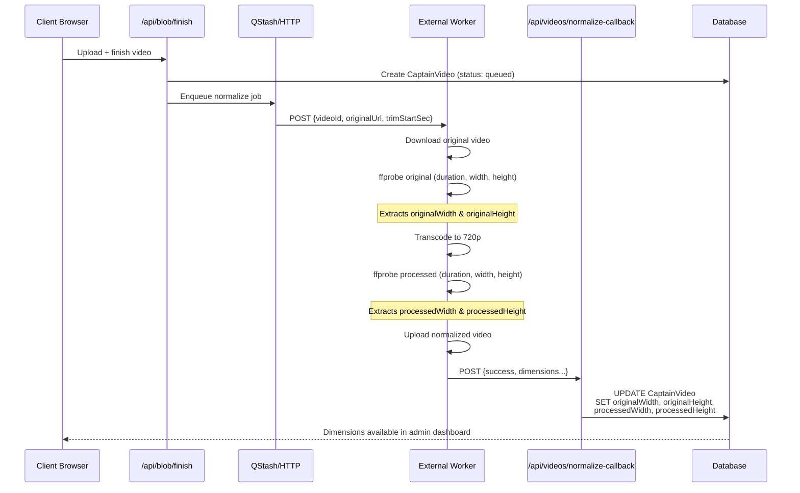

# Video Dimensions Implementation

**Date**: 16 October 2025  
**Status**: ✅ **Complete - Ready for Testing**  
**Related**: `ADMIN_VIDEO_DETAILS_FEATURE.md`

---

## Overview

Implemented **Option A** from the admin video details feature: storing video dimensions (width × height) in the database during video processing. This eliminates the need for separate dimension detection APIs and provides instant resolution display in the admin dashboard.

---

## What Was Implemented

### 1. Database Schema Changes

**File**: `prisma/schema.prisma`

Added four new nullable integer fields to the `CaptainVideo` model:

```prisma
model CaptainVideo {
  // ... existing fields ...
  originalWidth        Int?
  originalHeight       Int?
  processedWidth       Int?
  processedHeight      Int?
}
```

**Migration**: `20251016153815_add_video_dimensions`

```bash
npx prisma migrate dev --name add_video_dimensions
```

---

### 2. Worker Template Updates

**File**: `src/app/dev/_external-worker/normalize.ts`

#### Added Dimension Fields to Response Interface

```typescript
interface SuccessResult {
  // ... existing fields ...
  originalWidth: number | null;
  originalHeight: number | null;
  processedWidth: number | null;
  processedHeight: number | null;
}
```

#### Enhanced Original Video Probing

Replaced simple duration probe with comprehensive metadata extraction:

```typescript
// Before: Only duration
const originalDurationSec = await new Promise<number | null>(...);

// After: Duration + dimensions
const originalMetadata = await new Promise<{
  duration: number | null;
  width: number | null;
  height: number | null;
}>((resolve) => {
  fluent(inFile).ffprobe((err, data) => {
    if (err) return resolve({ duration: null, width: null, height: null });

    const durRaw = data?.format?.duration;
    const dur = Number(durRaw);

    const videoStream = data?.streams?.find((s) => s.codec_type === "video");

    resolve({
      duration: isFinite(dur) ? dur : null,
      width: videoStream?.width ?? null,
      height: videoStream?.height ?? null,
    });
  });
});

const originalDurationSec = originalMetadata.duration;
const originalWidth = originalMetadata.width;
const originalHeight = originalMetadata.height;
```

#### Enhanced Processed Video Probing

Similarly updated processed video metadata extraction:

```typescript
const processedMetadata = await new Promise<{
  duration: number | null;
  width: number | null;
  height: number | null;
}>((resolve) => {
  fluent(outFile).ffprobe((err, data) => {
    // ... same logic as original probe ...
  });
});

const processedDurationSec = processedMetadata.duration;
const processedWidth = processedMetadata.width;
const processedHeight = processedMetadata.height;
```

#### Updated Result Object

```typescript
const result: SuccessResult = {
  success: true,
  videoId,
  readyUrl: uploadedVideo.url,
  normalizedBlobKey,
  thumbnailUrl,
  thumbnailBlobKey,
  processingMs: Date.now() - started,
  originalDurationSec,
  processedDurationSec,
  appliedTrimStartSec: trimStartSec,
  originalWidth, // NEW
  originalHeight, // NEW
  processedWidth, // NEW
  processedHeight, // NEW
};
```

---

### 3. API Callback Handler Updates

**File**: `src/app/api/videos/normalize-callback/route.ts`

#### Added Dimension Fields to Payload Interface

```typescript
interface WorkerResultPayload {
  // ... existing fields ...
  originalWidth?: number;
  originalHeight?: number;
  processedWidth?: number;
  processedHeight?: number;
}
```

#### Updated Database Write Logic

```typescript
const updated = await prisma.captainVideo.update({
  where: { id: videoId },
  data: {
    // ... existing fields ...
    originalWidth: payload.originalWidth ?? video.originalWidth,
    originalHeight: payload.originalHeight ?? video.originalHeight,
    processedWidth: payload.processedWidth ?? video.processedWidth,
    processedHeight: payload.processedHeight ?? video.processedHeight,
    // ... rest of fields ...
  },
});
```

**Merge Strategy**: Uses nullish coalescing (`??`) to preserve existing values if payload doesn't provide them, ensuring idempotency.

---

### 4. Admin Dashboard Data Layer Updates

**File**: `src/app/(admin)/staff/media/data.ts`

#### Replaced TODO Resolution Function

```typescript
// REMOVED: Placeholder function
async function getVideoResolution(url: string | null): Promise<string | null> {
  // TODO: Implement video resolution detection
  return null;
}

// ADDED: Simple formatting helper
function formatResolution(
  width: number | null | undefined,
  height: number | null | undefined
): string | null {
  if (!width || !height) return null;
  return `${width}×${height}`;
}
```

#### Updated VideoRow Mapping

```typescript
// Before: Always null
originalResolution: null, // TODO: Implement resolution detection
normalizedResolution: null, // TODO: Implement resolution detection

// After: Use database dimensions
originalResolution: formatResolution(
  pickField<number>("originalWidth"),
  pickField<number>("originalHeight")
),
normalizedResolution: formatResolution(
  pickField<number>("processedWidth"),
  pickField<number>("processedHeight")
),
```

**Note**: Uses `pickField()` helper for safe access to optional Prisma fields that may not exist in older generated client types.

---

## Data Flow



---

## Expected Resolutions

Based on the normalization pipeline:

### Target Resolution: 720p

The worker uses these scale filters (attempts in order):

1. `scale=1280:720:force_original_aspect_ratio=decrease` - Cap both dimensions
2. `scale=-2:720:force_original_aspect_ratio=decrease` - Height ≤ 720px
3. `scale=1280:-2:force_original_aspect_ratio=decrease` - Width ≤ 1280px
4. No scaling (fallback for problematic videos)

### Common Transformation Examples

| Original Resolution | Processed Resolution | Notes                         |
| ------------------- | -------------------- | ----------------------------- |
| 1920×1080 (16:9)    | 1280×720 (16:9)      | Standard HD → 720p            |
| 3840×2160 (4K 16:9) | 1280×720 (16:9)      | 4K → 720p                     |
| 1080×1920 (9:16)    | 405×720 (9:16)       | Portrait video scaled down    |
| 1280×720 (16:9)     | 1280×720 (16:9)      | Already 720p, minimal change  |
| 640×480 (4:3)       | 640×480 (4:3)        | Lower than 720p, no upscaling |
| 2560×1440 (16:9)    | 1280×720 (16:9)      | 1440p → 720p                  |

**Note**: `force_original_aspect_ratio=decrease` ensures videos are **never upscaled**, only downscaled or kept as-is.

---

## Admin Dashboard Display

Once dimensions are stored, the admin dashboard automatically shows them:

```
┌─────────────────────────────────────┐
│ Details Column                      │
├─────────────────────────────────────┤
│ ORIGINAL                            │
│ Size: 45 MB                         │
│ Duration: 25s                       │
│ Resolution: 1920×1080               │ ← Now shows actual dimensions
├─────────────────────────────────────┤
│ NORMALIZED (720P)                   │
│ Size: 8.2 MB                        │
│ Duration: 25s                       │
│ Resolution: 1280×720                │ ← Now shows actual dimensions
└─────────────────────────────────────┘
```

### Fallback Behavior

- If dimensions are `null` → displays **"N/A"**
- Common for older videos processed before this migration
- New videos will always have dimensions

---

## Testing Checklist

### Prerequisites

- [ ] Database migration applied (`20251016153815_add_video_dimensions`)
- [ ] Prisma client regenerated (`npx prisma generate`)
- [ ] External worker updated with dimension probing (if using external worker)
- [ ] Local worker has ffmpeg/fluent-ffmpeg available

### New Video Upload Test

1. **Upload a new video** (any resolution)
2. **Wait for processing** (queued → processing → ready)
3. **Navigate to** `/staff/media?tab=videos&status=ready`
4. **Verify Details column shows**:
   - Original resolution (e.g., "1920×1080")
   - Normalized resolution (e.g., "1280×720")

### Multiple Resolution Test Cases

Test with various resolutions to verify scaling logic:

- [ ] **Landscape HD** (1920×1080) → Should become 1280×720
- [ ] **Portrait Mobile** (1080×1920) → Should become ~405×720
- [ ] **4K Landscape** (3840×2160) → Should become 1280×720
- [ ] **Already 720p** (1280×720) → Should stay 1280×720
- [ ] **Lower than 720p** (640×480) → Should stay 640×480 (no upscale)

### Edge Cases

- [ ] **Very old videos** (before migration) → Should show "N/A"
- [ ] **Failed processing** → No normalized resolution, only original
- [ ] **Fallback mode** (no scaling) → Both resolutions might be same

---

## Performance Impact

### ffprobe Overhead

- **Duration**: +50-100ms per probe (2× probes per video)
- **Total added**: ~100-200ms per video processing
- **Acceptable**: Processing already takes 10-30 seconds for transcoding

### Database Storage

- **4 new integer columns**: 4 × 4 bytes = 16 bytes per video
- **For 10,000 videos**: 160 KB additional storage
- **Negligible**: Well within database capacity

### Admin Dashboard Load

- **Before**: Fetching blob metadata only (size, contentType)
- **After**: Same + reading 4 integers from database
- **Impact**: None (integers already in memory from main query)

---

## Debugging

### Check Worker Logs

If dimensions are `null` after processing:

```bash
# Check external worker logs (Vercel dashboard)
# Look for "ffmpeg_command" and "ffprobe" entries
```

### Manual Database Check

```sql
SELECT
  id,
  originalWidth,
  originalHeight,
  processedWidth,
  processedHeight,
  processStatus
FROM "CaptainVideo"
WHERE processStatus = 'ready'
ORDER BY createdAt DESC
LIMIT 10;
```

Expected output:

```
| id     | originalWidth | originalHeight | processedWidth | processedHeight | processStatus |
|--------|---------------|----------------|----------------|-----------------|---------------|
| abc123 | 1920          | 1080           | 1280           | 720             | ready         |
| def456 | 3840          | 2160           | 1280           | 720             | ready         |
```

### Check Callback Payload

Enable debug mode to see what worker sends:

```bash
curl -X POST "https://your-app.vercel.app/api/videos/normalize-callback?debug=1" \
  -H "Content-Type: application/json" \
  -d '{
    "videoId": "test",
    "originalWidth": 1920,
    "originalHeight": 1080,
    "processedWidth": 1280,
    "processedHeight": 720
  }'
```

---

## Future Enhancements

### 1. Backfill Old Videos

Create a script to probe existing videos and update dimensions:

```typescript
// scripts/backfill-video-dimensions.ts
import { prisma } from "@/lib/prisma";
import ffmpeg from "fluent-ffmpeg";

async function backfillDimensions() {
  const videos = await prisma.captainVideo.findMany({
    where: {
      processStatus: "ready",
      originalWidth: null, // Missing dimensions
    },
  });

  for (const video of videos) {
    try {
      const metadata = await probeVideo(video.originalUrl);
      await prisma.captainVideo.update({
        where: { id: video.id },
        data: {
          originalWidth: metadata.width,
          originalHeight: metadata.height,
        },
      });
      console.log(`✓ ${video.id}: ${metadata.width}×${metadata.height}`);
    } catch (err) {
      console.error(`✗ ${video.id}:`, err);
    }
  }
}
```

### 2. Compression Ratio Analysis

Now that we have both original and normalized resolutions, calculate pixel reduction:

```typescript
const originalPixels = originalWidth * originalHeight;
const processedPixels = processedWidth * processedHeight;
const pixelReduction = ((1 - processedPixels / originalPixels) * 100).toFixed(
  1
);
// e.g., "75.0% pixel reduction (1920×1080 → 1280×720)"
```

### 3. Quality Metrics Dashboard

Add charts showing:

- Most common input resolutions
- Average compression ratios by resolution
- Storage savings over time

---

## Rollback Plan

If issues occur, migration can be rolled back:

```bash
# Revert database migration
npx prisma migrate resolve --rolled-back 20251016153815_add_video_dimensions

# Regenerate Prisma client
npx prisma generate
```

**Note**: Dimensions are nullable, so existing code continues to work without them.

---

## Related Documentation

- `ADMIN_VIDEO_DETAILS_FEATURE.md` - Admin dashboard feature overview
- `docs/API_VIDEO_ROUTES.md` - Video processing API reference
- `docs/VIDEO_UPLOAD_MIGRATION.md` - Overall video upload architecture

---

**Status**: ✅ Implementation complete, ready for production deployment. Admin dashboard will now display actual video resolutions instead of "N/A".
