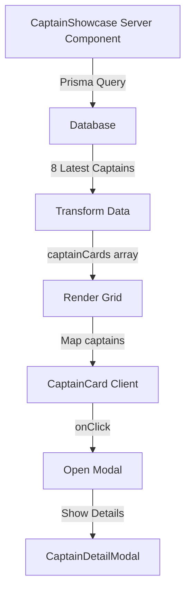

# Captain Showcase

## Overview

Public-facing showcase section on the landing page displaying verified captain profiles to encourage new captain registrations through social proof. Auto-populates with latest registered captains who have active charters.

**Location:** Landing page (`src/app/page.tsx`) - positioned after "How It Works" section, before pricing

**Purpose:** Build trust, demonstrate platform value, provide inspiration for potential captains

**Tech Stack:** Next.js 15 Server Components + Prisma + Radix UI Dialog + Tailwind CSS

---

## Architecture

### Component Hierarchy

```
CaptainShowcase.tsx (Server Component)
└── Grid Container
    ├── CaptainCard.tsx (Client Component) [x8]
    │   └── Card with hover animations
    └── CaptainDetailModal.tsx (Client Component)
        └── Radix Dialog with full details
```

### Data Flow



---

## Implementation

### 1. CaptainShowcase.tsx (Main Container)

**File:** `src/components/CaptainShowcase.tsx` (128 lines)  
**Type:** Server Component (async)

**Database Query:**

```typescript
const captains = await prisma.captainProfile.findMany({
  take: 8,
  orderBy: { createdAt: "desc" },
  where: {
    NOT: {
      displayName: {
        contains: "Dummy",
        mode: "insensitive",
      },
    },
  },
  select: {
    id: true,
    userId: true,
    displayName: true,
    firstName: true,
    lastName: true,
    bio: true,
    experienceYrs: true,
    avatarUrl: true,
    createdAt: true,
    user: { select: { id: true } },
    charters: {
      select: {
        id: true,
        state: true,
        city: true,
        trips: { select: { id: true } },
      },
      where: { isActive: true },
    },
  },
});
```

**Key Features:**

- Filters out dummy/test captains (NOT LIKE '%Dummy%')
- Only includes captains with at least one active charter
- Fetches 8 most recent captains
- Calculates total trip count across all active charters
- Returns `null` if no captains found (graceful degradation)

**Data Transformation:**

```typescript
const captainCards = captains.map((captain) => {
  const tripCount = captain.charters.reduce(
    (sum, charter) => sum + charter.trips.length,
    0
  );

  return {
    id: captain.userId,
    displayName: captain.displayName,
    firstName: captain.firstName,
    lastName: captain.lastName,
    bio: captain.bio,
    experienceYrs: captain.experienceYrs,
    avatarUrl: captain.avatarUrl,
    state: captain.charters[0]?.state || "Malaysia",
    city: captain.charters[0]?.city || "Unknown",
    charterCount: tripCount,
    createdAt: captain.createdAt,
  };
});
```

**Layout Structure:**

```tsx
<section className="bg-gradient-to-b from-white to-neutral-50">
  <div className="mx-auto w-full max-w-7xl px-4 py-20 sm:px-6 lg:px-8">
    {/* Section Header */}
    <div className="mb-12 text-center">
      <div className="mb-4 inline-block rounded-full bg-[#EC2227]/10 px-4 py-2">
        <span className="text-sm font-semibold text-[#EC2227]">
          ⚓ OUR CAPTAINS
        </span>
      </div>
      <h2 className="text-4xl font-bold">Meet Our Trusted Captains</h2>
      <p className="mt-4 text-lg text-neutral-600">
        Join our community of successful fishing charter captains
      </p>
    </div>

    {/* Captain Grid - Responsive */}
    <div className="grid gap-6 sm:grid-cols-2 lg:grid-cols-4">
      {captainCards.map((captain) => (
        <CaptainCard key={captain.id} captain={captain} />
      ))}
    </div>

    {/* Bottom CTA */}
    <div className="mt-12 text-center">
      <Link
        href="/signup"
        className="inline-flex items-center gap-2 rounded-lg bg-[#EC2227] px-8 py-4 text-lg font-semibold text-white transition-colors hover:bg-[#c61d22]"
      >
        <Anchor className="h-5 w-5" />
        Start Your Journey as a Captain
      </Link>
    </div>
  </div>
</section>
```

### 2. CaptainCard.tsx (Individual Card)

**File:** `src/components/CaptainCard.tsx`  
**Type:** Client Component (`"use client"`)

**Props Interface:**

```typescript
export interface CaptainCardData {
  id: string;
  displayName: string;
  bio: string;
  experienceYrs: number;
  avatarUrl: string | null;
  firstName: string;
  lastName: string;
  state: string;
  city: string;
  charterCount: number;
}

interface CaptainCardProps {
  captain: CaptainCardData;
}
```

**Features:**

- Hover animations (scale + shadow)
- Click to open detail modal
- Experience badge overlay
- Fallback avatar (Anchor icon) when no image
- Location display
- Bio truncation with "Read more" hint

**Visual Design:**

```tsx
<div
  onClick={() => setSelectedCaptain(captain)}
  className="group relative cursor-pointer overflow-hidden rounded-2xl bg-white shadow-lg transition-all duration-300 hover:scale-105 hover:shadow-2xl"
>
  {/* Avatar Section with Gradient Overlay */}
  <div className="relative h-48 bg-gradient-to-br from-[#EC2227] to-[#c61d22]">
    {captain.avatarUrl ? (
      <Image
        src={captain.avatarUrl}
        alt={captain.displayName}
        fill
        className="object-cover opacity-90"
      />
    ) : (
      <div className="flex h-full items-center justify-center">
        <Anchor className="h-16 w-16 text-white/80" />
      </div>
    )}

    {/* Experience Badge - Positioned Top Right */}
    <div className="absolute right-4 top-4 rounded-full bg-white/95 px-3 py-1 shadow-lg">
      <p className="text-sm font-bold text-[#EC2227]">
        {captain.experienceYrs} yrs exp
      </p>
    </div>
  </div>

  {/* Content Section */}
  <div className="p-6">
    <h3 className="text-xl font-bold text-neutral-900">
      {captain.displayName}
    </h3>

    <div className="mt-2 flex items-center text-sm text-neutral-600">
      <MapPin className="mr-1 h-4 w-4" />
      {captain.city}, {captain.state}
    </div>

    <p className="mt-3 line-clamp-3 text-sm text-neutral-600">{captain.bio}</p>

    <div className="mt-4 flex items-center justify-between text-xs text-neutral-500">
      <span>{captain.charterCount} trips available</span>
      <span className="text-[#EC2227] group-hover:underline">Read more →</span>
    </div>
  </div>
</div>
```

### 3. CaptainDetailModal.tsx (Full Details)

**File:** `src/components/CaptainDetailModal.tsx`  
**Type:** Client Component (Radix Dialog)

**Props:**

```typescript
interface CaptainDetailModalProps {
  captain: CaptainCardData | null;
  open: boolean;
  onOpenChange: (open: boolean) => void;
}
```

**Features:**

- Full-screen overlay (semi-transparent backdrop)
- Keyboard support (ESC to close)
- Click outside to close
- Smooth animations (scale in/fade)
- Gradient header design
- Statistics grid display
- Strong CTA button to registration

**Modal Structure:**

```tsx
<Dialog open={open} onOpenChange={onOpenChange}>
  <DialogContent className="max-w-2xl">
    {/* Gradient Header with Large Avatar */}
    <div className="relative -mx-6 -mt-6 h-48 bg-gradient-to-br from-[#EC2227] to-[#c61d22]">
      {captain.avatarUrl ? (
        <Image
          src={captain.avatarUrl}
          alt={captain.displayName}
          width={120}
          height={120}
          className="absolute bottom-0 left-8 translate-y-1/2 rounded-full border-4 border-white"
        />
      ) : (
        <div className="absolute bottom-0 left-8 flex h-[120px] w-[120px] translate-y-1/2 items-center justify-center rounded-full border-4 border-white bg-neutral-200">
          <Anchor className="h-12 w-12 text-neutral-500" />
        </div>
      )}
    </div>

    {/* Content Section with Padding for Avatar Overlap */}
    <div className="mt-16 px-8 pb-6">
      <div className="mb-2 flex items-center justify-between">
        <h2 className="text-3xl font-bold">{captain.displayName}</h2>
        <Badge variant="outline" className="text-[#EC2227]">
          {captain.experienceYrs} years experience
        </Badge>
      </div>

      <div className="flex items-center text-neutral-600">
        <MapPin className="mr-2 h-5 w-5" />
        <span>
          {captain.city}, {captain.state}
        </span>
      </div>

      {/* Statistics Grid */}
      <div className="mt-6 grid grid-cols-2 gap-4">
        <div className="rounded-lg bg-neutral-50 p-4">
          <p className="text-2xl font-bold text-[#EC2227]">
            {captain.charterCount}
          </p>
          <p className="text-sm text-neutral-600">Trips Available</p>
        </div>
        <div className="rounded-lg bg-neutral-50 p-4">
          <p className="text-2xl font-bold text-[#EC2227]">
            {captain.experienceYrs}+
          </p>
          <p className="text-sm text-neutral-600">Years Experience</p>
        </div>
      </div>

      {/* Bio Section */}
      <div className="mt-6">
        <h3 className="mb-2 text-lg font-semibold">About</h3>
        <p className="text-neutral-600">{captain.bio}</p>
      </div>

      {/* CTA Button */}
      <div className="mt-8">
        <Link
          href="/signup"
          className="flex w-full items-center justify-center gap-2 rounded-lg bg-[#EC2227] py-4 text-white transition-colors hover:bg-[#c61d22]"
        >
          <Anchor className="h-5 w-5" />
          Start Your Journey as a Captain
        </Link>
      </div>
    </div>
  </DialogContent>
</Dialog>
```

---

## Integration

### Landing Page Placement

**File:** `src/app/page.tsx`

**Position in Layout:**

```
1. Hero Section (above fold)
2. Value Props (blue background, 3 cards)
3. How It Works (3 steps with icons)
4. 👉 Captain Showcase (this feature) 👈
5. Pricing Section (plans comparison)
6. FAQ Section
7. Footer CTA
```

**Import & Usage:**

```tsx
import CaptainShowcase from "@/components/CaptainShowcase";

export default function HomePage() {
  return (
    <main>
      {/* ...Hero, Value Props, How It Works... */}

      <CaptainShowcase />

      {/* ...Pricing, FAQ, Footer... */}
    </main>
  );
}
```

---

## Design System

### Brand Colors

- **Primary Red:** `#EC2227` (buttons, badges, accents)
- **Primary Red Hover:** `#c61d22` (darker red)
- **Neutral Background:** `from-white to-neutral-50` (gradient)
- **Text Colors:**
  - Headings: `text-neutral-900`
  - Body: `text-neutral-600`
  - Subtle: `text-neutral-500`

### Responsive Breakpoints

| Screen Size       | Grid Columns | Card Width |
| ----------------- | ------------ | ---------- |
| Mobile (<640px)   | 1 column     | 100%       |
| Tablet (≥640px)   | 2 columns    | ~50%       |
| Desktop (≥1024px) | 4 columns    | ~25%       |

**Tailwind Classes:**

```css
grid gap-6 sm:grid-cols-2 lg:grid-cols-4
```

### Spacing & Layout

- **Section padding:** `py-20` (vertical), `px-4 sm:px-6 lg:px-8` (horizontal)
- **Max width:** `max-w-7xl` (1280px) centered
- **Card gap:** `gap-6` (1.5rem)
- **Card padding:** `p-6` (1.5rem internal)

### Animations & Interactions

**Hover Effects (CaptainCard):**

```css
transition-all duration-300
hover:scale-105
hover:shadow-2xl
```

**Modal Animations:**

- Backdrop: Fade in (opacity 0 → 1)
- Content: Scale + fade (scale 95% → 100%, opacity 0 → 1)
- Exit: Reverse animations

**Button Hover:**

```css
transition-colors
hover:bg-[#c61d22]
```

---

## User Experience Flow

### Visitor Journey

1. **Discovery:**

   - Scroll down landing page
   - Pass hero, value props, how-it-works
   - Arrive at "Meet Our Trusted Captains" section

2. **Browse Captains:**

   - See 8 captain cards in responsive grid
   - Each card shows:
     - Avatar (or fallback anchor icon)
     - Name and location
     - Years of experience (badge)
     - Bio preview (3 lines max)
     - Trip count

3. **View Details:**

   - Click any captain card
   - Modal opens with full information:
     - Large avatar with gradient header
     - Complete bio
     - Statistics (trips & experience)
     - Location details

4. **Take Action:**
   - Click "Start Your Journey as a Captain" CTA
   - Redirect to `/signup` page
   - Begin registration process

### Empty State Handling

If no captains found (all filtered out or none registered):

```typescript
if (captains.length === 0) {
  return null; // Section hidden entirely
}
```

No error message shown - graceful degradation by hiding section.

---

## Data Schema

### CaptainCardData Interface

```typescript
export interface CaptainCardData {
  id: string; // User ID (not CaptainProfile ID)
  displayName: string; // Captain's chosen display name
  firstName: string; // Legal first name
  lastName: string; // Legal last name
  bio: string; // Captain's biography/description
  experienceYrs: number; // Years of fishing experience
  avatarUrl: string | null; // Profile picture URL (Vercel Blob)
  state: string; // State/region (e.g., "Sabah")
  city: string; // City name (e.g., "Kota Kinabalu")
  charterCount: number; // Total active trips across all charters
}
```

### Database Relations

**Query Path:**

```
CaptainProfile
├── user (User)
└── charters (Charter[])
    ├── trips (Trip[])
    ├── state
    └── city
```

**Trip Count Calculation:**

```typescript
const tripCount = captain.charters.reduce(
  (sum, charter) => sum + charter.trips.length,
  0
);
```

---

## Performance Considerations

### Server-Side Rendering

- **Fetch Time:** ~50-100ms (Prisma query)
- **Cached:** Page can be statically generated (ISR)
- **Revalidation:** Consider `revalidate: 3600` (1 hour) if using ISR

### Image Optimization

**Next.js Image Component:**

```tsx
<Image
  src={captain.avatarUrl}
  alt={captain.displayName}
  fill // Responsive sizing
  className="object-cover opacity-90"
/>
```

Benefits:

- Automatic WebP conversion
- Lazy loading (below fold)
- Responsive srcset generation
- Blur placeholder option (add `placeholder="blur"`)

### Query Optimization

**Efficient Select:**

- Only fetch required fields (not full user/charter objects)
- Use `select` instead of `include` for smaller payloads
- Limit to 8 captains (sufficient for showcase)

**Indexed Fields:**

- `CaptainProfile.createdAt` (for orderBy)
- `Charter.isActive` (for where filter)

---

## Conversion Strategy

### Social Proof Elements

1. **Real Profiles:** Authentic captains (no stock photos)
2. **Experience Badges:** Immediate credibility signal
3. **Trip Counts:** Demonstrates active platform usage
4. **Location Diversity:** Shows geographic reach
5. **Personal Bios:** Humanizes captains, builds connection

### Call-to-Action Placement

**Two CTA Points:**

1. **Bottom of showcase:** "Start Your Journey as a Captain" (primary)
2. **Inside modal:** Same CTA after viewing details (secondary)

**CTA Design:**

- High contrast red button (`#EC2227`)
- Large touch target (py-4)
- Anchor icon for thematic consistency
- Clear, action-oriented copy

### Psychological Triggers

- **Authority:** Years of experience displayed
- **Social Proof:** "Trusted Captains" headline
- **Belonging:** "Join our community" messaging
- **Success Stories:** Captains with active trips = success

---

## Testing

### Manual Testing Checklist

**Functionality:**

- [ ] Section renders with 8 captains
- [ ] Cards display all information correctly
- [ ] Hover animations work smoothly
- [ ] Click card opens modal
- [ ] Modal displays full details
- [ ] Click outside modal closes it
- [ ] ESC key closes modal
- [ ] CTA buttons redirect to `/signup`
- [ ] Fallback avatars show when no image
- [ ] Section hidden when no captains

**Responsive Design:**

- [ ] Mobile (375px): 1 column, readable text
- [ ] Tablet (768px): 2 columns, balanced layout
- [ ] Desktop (1280px): 4 columns, optimal spacing
- [ ] Ultra-wide (1920px): Max-width container centers

**Accessibility:**

- [ ] Modal focus trap works
- [ ] Keyboard navigation (Tab, ESC)
- [ ] Alt text on images
- [ ] Semantic HTML (section, h2, p)
- [ ] Color contrast meets WCAG AA

**Performance:**

- [ ] Page load time <3s
- [ ] Images lazy load
- [ ] No layout shift (CLS)
- [ ] Smooth animations (no jank)

### Automated Tests (Suggested)

**Unit Tests:**

```typescript
// Test data transformation
describe("CaptainShowcase data transformation", () => {
  it("calculates trip count correctly", () => {
    const mockCaptain = {
      charters: [
        { trips: [{ id: "1" }, { id: "2" }] },
        { trips: [{ id: "3" }] },
      ],
    };
    // Expected: tripCount = 3
  });
});
```

**Integration Tests:**

```typescript
// Test database query
describe('CaptainShowcase query', () => {
  it('fetches 8 most recent captains', async () => {
    const result = await prisma.captainProfile.findMany({...});
    expect(result).toHaveLength(8);
    expect(result[0].createdAt).toBeInstanceOf(Date);
  });
});
```

**E2E Tests (Playwright):**

```typescript
test("Captain showcase user flow", async ({ page }) => {
  await page.goto("/");
  await page.locator("text=Meet Our Trusted Captains").scrollIntoViewIfNeeded();
  await page.locator(".captain-card").first().click();
  await expect(page.locator('[role="dialog"]')).toBeVisible();
  await page.keyboard.press("Escape");
  await expect(page.locator('[role="dialog"]')).not.toBeVisible();
});
```

---

## Troubleshooting

### Common Issues

**"No captains displayed" (section hidden)**

- **Cause:** All captains filtered out (contain "Dummy") or no captains registered
- **Solution:** Register real captains with active charters
- **Debug:** Remove `NOT displayName LIKE '%Dummy%'` filter temporarily

**Modal not opening**

- **Cause:** State management issue, `selectedCaptain` not set
- **Solution:** Check `useState` in CaptainCard, ensure `setSelectedCaptain` called
- **Debug:** Add `console.log(selectedCaptain)` in modal component

**Images not loading**

- **Cause:** Invalid `avatarUrl` (expired Vercel Blob URL, wrong domain)
- **Solution:** Re-upload avatar via verification page
- **Fallback:** Anchor icon displays automatically if `avatarUrl` is null

**Layout shift on load**

- **Cause:** Images loading without reserved space
- **Solution:** Use Next.js Image `fill` prop + aspect ratio container
- **Fix:** Add `h-48` to avatar container for consistent height

**Responsive grid broken**

- **Cause:** Tailwind classes not applying (purged CSS)
- **Solution:** Ensure `content` paths in `tailwind.config.ts` include `src/components/**/*.tsx`
- **Check:** Inspect element to verify classes present in DOM

---

## Future Enhancements

### Phase 1: Search & Filter

- [ ] Location-based filtering (dropdown for states)
- [ ] Experience range filter (0-5 yrs, 5-10 yrs, 10+ yrs)
- [ ] Search by captain name
- [ ] Sort options (newest, most experienced, most trips)

### Phase 2: Enhanced Profiles

- [ ] Captain ratings & reviews (star system)
- [ ] Photo gallery (trip photos)
- [ ] Specializations/certifications badges
- [ ] Languages spoken
- [ ] Response time indicator

### Phase 3: "View All Captains" Page

- [ ] Dedicated `/captains` route
- [ ] Pagination or infinite scroll
- [ ] Advanced filters sidebar
- [ ] Map view with location pins
- [ ] Direct booking integration

### Phase 4: Gamification

- [ ] Achievement badges (100 trips, 5 years, etc.)
- [ ] "Captain of the Month" feature
- [ ] Success story spotlights
- [ ] Video testimonials

### Phase 5: SEO & Marketing

- [ ] Individual captain profile pages (`/captain/[id]`)
- [ ] Structured data (schema.org Person markup)
- [ ] Open Graph meta tags for social sharing
- [ ] Canonical URLs for indexing

---

## Related Documentation

- [Landing Page Structure](/docs/guides/LANDING_PAGE.md)
- [Captain Profile Management](/docs/features/CAPTAIN-PROFILE.md)
- [Charter Creation Flow](/docs/features/charter-onboarding/README.md)
- [Image Upload System](/docs/CAPTAIN_VERIFICATION_DOCUMENTS.md)
- [Database Schema Reference](/prisma/schema.prisma)

---

## Analytics & Metrics

### Key Performance Indicators

**Engagement Metrics:**

- Click-through rate (CTR) on captain cards
- Modal open rate
- Time spent viewing details
- CTA click rate (bottom vs modal)

**Conversion Metrics:**

- Showcase view → signup conversion
- Bounce rate at showcase section
- Scroll depth (% reaching showcase)

**Content Metrics:**

- Average experience years displayed
- Average trip count per captain
- Location distribution of captains

### Tracking Implementation (Suggested)

**Google Analytics 4:**

```typescript
// In CaptainCard.tsx
const handleCardClick = () => {
  gtag("event", "captain_card_click", {
    captain_id: captain.id,
    experience_years: captain.experienceYrs,
  });
  setSelectedCaptain(captain);
};

// In CaptainDetailModal.tsx
const handleCTAClick = () => {
  gtag("event", "captain_showcase_cta", {
    source: "modal",
    captain_id: captain.id,
  });
};
```

---

## Changelog

**2025-10-17:** Consolidated 10+ showcase docs into single reference  
**2025-10-15:** Added dummy captain filtering to query  
**2025-10-10:** Initial implementation complete (3 components)  
**2025-10-08:** Design mockups approved  
**2025-10-05:** Feature specification created
